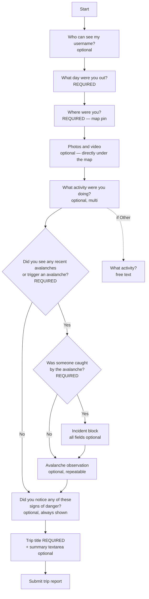
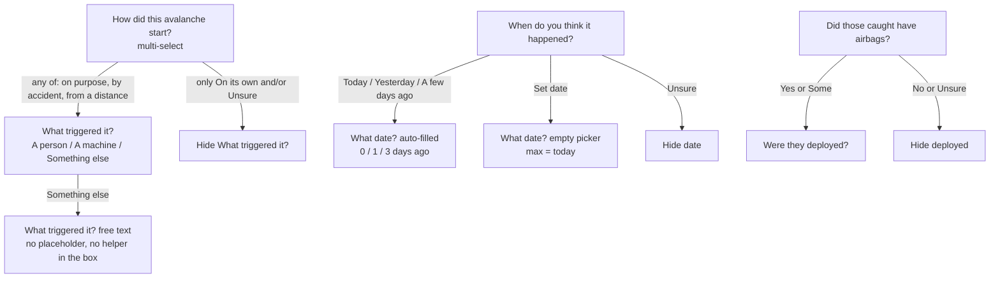

# Avalanche Canada trip report — flow spec

Share this with engineering. It is the branching logic, required vs optional fields, options, and helper text from the AvCan prototype (`avcan/index.html`).

**Required to submit:** trip title, date out, map pin, and “did you see avalanches?”  
If that last answer is Yes, “was someone caught?” is also required.  
Everything else can be skipped.

---

## 1. Branching flow

### Path summary

| Path | Condition | Extra blocks | Summary copy |
| --- | --- | --- | --- |
| Basic | Saw avalanches = No | None | Basic trip summary |
| Avalanche | Saw = Yes, Caught = No | Avalanche observation | Avalanche trip summary |
| Incident | Saw = Yes, Caught = Yes | Incident, then Avalanche observation | Incident “What happened?” |

Instability is on **every** path, including after a Yes avalanche.

---

## 2. Follow-up conditions

---

## 3. Screen order

1. Who can see my username?
2. When
3. Where
4. Photos and video *(directly under the map)*
5. Activity
6. Avalanches *(and Caught if Yes)*
7. Incident *(only if Caught = Yes)*
8. Avalanche observation *(only if Saw = Yes)*
9. Instability
10. Trip title + Trip summary *(same section)*
11. Submit

---

## 4. Fields

**Control notes**

- Short lists = **pill chips**. Do not turn chips into checkbox rows.
- Long lists (instability, how it started, weak layer) = **full-width checkbox rows**.
- `Unsure` / `None of these` / `Not sure` are exclusive: picking one clears the others.
- Never use the label “I don’t know”. Use **Unsure**.

### Always on

#### Who can see my username? — optional

| | |
| --- | --- |
| **Question** | Who can see my username? |
| **Helper** | Choosing “everyone” makes you eligible for Trip Report prizes. |
| **Control** | Single chip |
| **Options** | Everyone (`public`) · Only Forecasters (`noname`) |
| **Default** | Everyone |

#### When — required

| | |
| --- | --- |
| **Question** | What day were you out? |
| **Control** | Date |
| **Key** | `observed_at` |
| **Default** | Today |
| **Error** | Please choose a date. |

#### Where — required

| | |
| --- | --- |
| **Question** | Where were you? |
| **Helper** | Tap the map to set a location. Then drag and zoom — the pin stays in the centre. |
| **Control** | Pin map. Locate me stays off until they tap Set location. |
| **Stored** | `lat`, `lng`, derived forecast region |
| **Error** | Please set a location on the map. |

#### Photos and video — optional

| | |
| --- | --- |
| **Label** | Add photos or video |
| **Helper** | The single most useful thing you can send us |
| **Control** | Multi file, `image/*` and `video/*` |
| **Placement** | Immediately under the map |

#### Activity — optional

| | |
| --- | --- |
| **Question** | What activity were you doing? |
| **Helper** | Select all that apply. |
| **Control** | Multi chips |
| **Options** | Skiing · Cross-country skiing · Snowboarding · Ice climbing · Mountaineering · Snowshoeing · Snowmobiling · Snowbiking · Hiking · Other |
| **Follow-up** | If Other: **What activity?** text, placeholder `e.g. fat biking` |

#### Avalanches — required

| | |
| --- | --- |
| **Question** | Did you see any recent avalanches or trigger an avalanche? |
| **Helper** | Choose one. |
| **Control** | Single chip |
| **Options** | Yes · No |
| **Error** | Please answer this question. |

#### Instability — optional, always shown

| | |
| --- | --- |
| **Question** | Did you notice any of these signs of danger? |
| **Helper** | Select all that apply. Signs the snowpack may be unstable. |
| **Control** | Multi checkbox rows. **None of these** is exclusive. |
| **Options** | See list below |

Options (label — helper under the label):

1. 30 cm or more of new snow in past 24 hours
2. Substantial wind loading — *snow blowing off ridges and/or wind deposits forming*
3. Whumpfing — *an audible collapse of a weak layer*
4. Shooting cracks — *cracks that shoot out across the slope*
5. Critical warming from sun, warm air temperature, or rain — *signs include wet surface snow, pinwheeling, tree bombs*
6. None of these

---

### If Saw avalanches = Yes

#### Caught — required

| | |
| --- | --- |
| **Question** | Was someone caught by the avalanche? |
| **Helper** | Choose one. |
| **Control** | Single chip |
| **Options** | Yes · No |
| **Error** | Please answer this question. |

---

### If Caught = Yes — Incident, all optional

Section helper: *Optional. Skip what you don’t know.*

| Question | Control | Options |
| --- | --- | --- |
| How many people were in the group? | Number, min 1 | — |
| How many were caught? | Number, min 1 | — |
| How many were partially buried? | Number, min 1 | — |
| How many were fully buried? | Number, min 1 | — |
| Did all group members have a transceiver, shovel, and probe? | Single chip. Helper: Choose one. | Yes · Some · No · Unsure |
| Did those caught have airbags? | Single chip. Helper: Choose one. | Yes · Some · No · Unsure |
| Were they deployed? | Single chip. Helper: Choose one. **Only if airbags = Yes or Some.** | Yes · No · Unsure |

---

### If Saw avalanches = Yes — Avalanche observation, all optional

Section helper: *Optional. Skip or collapse if you have nothing to add.*

Repeatable. First observation can **Skip** (collapse). Button: **+ Add another avalanche observation**.

| Question | Control | Options | Helper |
| --- | --- | --- | --- |
| When do you think it happened? | Single chip | Today · Yesterday · A few days ago · Unsure · Set date | Choose one. |
| What date? | Date, max today | Auto-fill if Today / Yesterday / A few days ago | Shown for those three plus Set date |
| How did this avalanche start? | Multi checkbox rows. Unsure exclusive. | On its own · Someone triggered it on purpose · Someone triggered it by accident · Someone triggered it from a distance · Unsure | Select all that apply. “On its own” means caused by snow, wind, warming, a cornice fall, or other natural factors, rather than by a person or machine. People must be able to pick more than one (e.g. by accident **and** from a distance). |
| What triggered it? | Single chip | A person · A machine · Something else | Choose one. Show if any start how is not On its own and not Unsure. |
| What triggered it? (other) | Text | — | **No placeholder. No helper in the box.** Only if Something else. |
| Which way did the slope face? | Single chip | N · NE · E · SE · S · SW · W · NW · Unsure | Choose one. |
| What elevation band? | Single chip | Alpine · Treeline · Below · Unsure | Choose one. |
| What size was it? | Single chip | 1 · 1.5 · 2 · 2.5 · 3 · 3.5 · 4 · 4.5 · 5 · Unsure | Choose one. Bulletin-scale helper still TBD with Stan. |
| What avalanche problem was it? | Single chip | Storm · Wind · Persistent · Deep persistent · Wet slab · **Wet loose** · **Dry Loose** · Cornice · Glide · Unsure | Choose one. |

#### Add more details — second screen, all optional

Opens a sheet. Skip control and header both use:

> Add details if you have them, skip if you don’t.

**Skip this and go back to the report** returns to page 1. Footer: **Back to the report**.

| Question | Control | Options | Helper |
| --- | --- | --- | --- |
| Crown depth (cm) | Number | — | — |
| Width (m) | Number | — | — |
| Run length (m) | Number | — | — |
| Start zone elevation (ft) | Number | — | — |
| Start zone incline (°) | Number | — | — |
| Weak layer information | Multi checkbox rows. Not sure exclusive. | Surface hoar · Facets · Depth hoar · New snow · Not sure | If you know the weak layer crystal type, let us know. Skip if you are unsure. |
| Crust near weak layer | Single chip | Yes · No | Choose one. Not part of the crystal-type list. |

---

## 5. Trip title + summary — same section, always last

**Trip title** is required. Placeholder: `e.g. Spearhead Traverse`. Error: *Please enter a trip title.*

The textarea is optional. Only the question, helper, and placeholder change.

### Basic — no avalanche

- **Question:** Trip summary
- **Helper:** Tell us about your day. Short sentences or point form are great. Don’t worry about perfect writing or technical terms. Forecasters read every report.
- **Placeholder:** What were the snow and weather like? What did you ride or avoid? How did the day compare with the forecast? Did anything surprise you?

### Avalanche — saw Yes, nobody caught

- **Question:** Trip summary
- **Helper:** same as basic
- **Placeholder:** Any other avalanche details to share? What were the snow and weather like? What did you ride or avoid? How did the day compare with the forecast? Did anything surprise you?

### Incident — someone caught

- **Question:** What happened?
- **Helper:** Short sentences or point form are great. Don’t worry about perfect writing or technical terms. Forecasters read every report.
- **Placeholder:** In your own words, describe what happened and what led up to it. Share anything else about the day that feels important. Include only what you’re comfortable sharing, and leave out names and judgement.

---

## 6. Open item

Size helper is still “Choose one.” Confirm with Stan whether bulletin-scale language should sit under **What size was it?**
